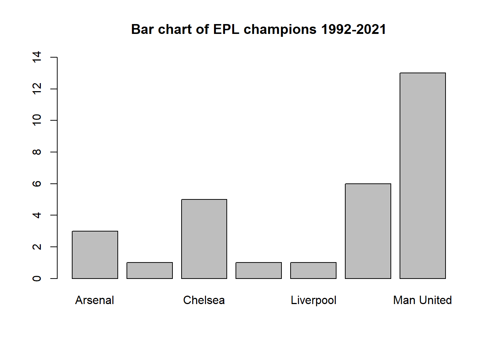
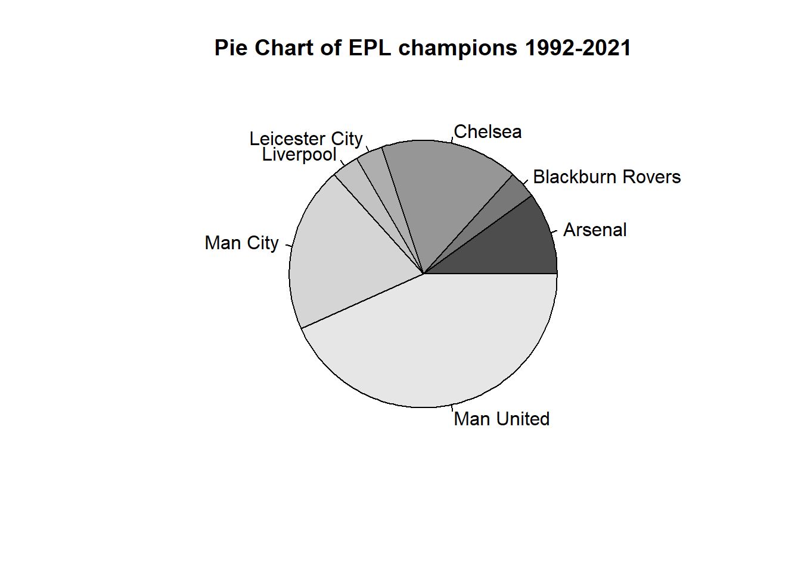

### 1. Soccer Analytics: The Way Ahead

Page 7


::: {.cell}

```{.r .cell-code}
Clubs <- c("Arsenal", "Blackburn Rovers", "Chelsea", "Leicester City", "Liverpool", "Man City", "Man United")
Titles <- c(3,1,5,1,1,6,13)
epl_dat <- cbind.data.frame(Clubs, Titles)
print(epl_dat)
```

::: {.cell-output .cell-output-stdout}

```
             Clubs Titles
1          Arsenal      3
2 Blackburn Rovers      1
3          Chelsea      5
4   Leicester City      1
5        Liverpool      1
6         Man City      6
7       Man United     13
```


:::
:::

::: {.cell}

```{.r .cell-code}
# Bar plot
barplot(epl_dat$Titles, names.arg = epl_dat$Clubs, ylim = c(0,14))
title("Bar chart of EPL champions 1992-2021")
```

::: {.cell-output-display}
{width=672}
:::
:::

::: {.cell}

```{.r .cell-code}
#Pie chart
my_colours <- gray.colors(length(epl_dat$Clubs))
pie(Titles, labels = Clubs, col = my_colours, main = "Pie Chart of EPL champions 1992-2021")
```

::: {.cell-output-display}
{width=672}
:::
:::


